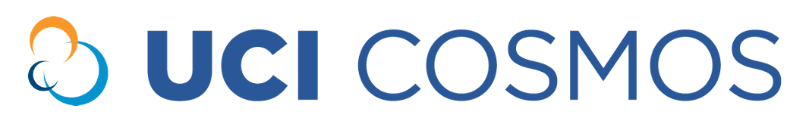

```{r fig.align='center', out.width="80%", echo=FALSE}

```

<style type="text/css">

body{ /* Normal  */
      font-size: 12px;
  }
td {  /* Table  */
  font-size: 8px;
}
h1.title {
  font-size: 30px;
  color: DarkRed;
}
h1 { /* Header 1 */
  font-size: 26px;
  color: DarkBlue;
}
h2 { /* Header 2 */
    font-size: 22px;
  color: DarkBlue;
}
h3 { /* Header 3 */
  font-size: 18px;
  font-family: "Times New Roman", Times, serif;
  color: DarkBlue;
}
code.r{ /* Code block */
    font-size: 12px;
}
pre { /* Code block - determines code spacing between lines */
    font-size: 14px;
}
</style>


The California State Summer School for Mathematics and Science (COSMOS) is a summer program established by the California State Legislature for high school students interested in STEM subjects.
[UC Irvine](https://www.cosmos.uci.edu) is one of the campuses that hosts talented high school students enrolled in [one of the many clusters](https://www.cosmos.uci.edu/clusters). This specific cluster focuses on data science in biomedical sciences. 

This cluster explores how data science is used to better understand biological and medical processes. Think about the data recorded from the cell activities of the brain of a patient diagnosed with Alzheimer’s disease. What are the most striking patterns of this data in contrast with the data obtained from a person with normal brain activity? What regions in the brain demonstrate such abnormalities more vividly and is there a way to use data from potentially a large number of patients to build a tool or mechanism for predicting Alzheimer’s in the early stages of its development? How reliable can such a tool be, and is there a way to improve its reliability as we collect more data from more subjects?

In this cluster, students will acquire the data science skills needed to answer questions as they apply to numerous disciplines in the biological sciences, including but not limited to neuroscience, public health, and pharmacology. Students will cover exploratory data analysis, data visualization, foundations of probability, design of experiments, linear models, and foundations of machine learning, and statistical inference. Students will learn the R programming language to analyze, summarize, and visualize data (no prior programming experience is required). Student capstone projects will involve working with real data to solve a scientific problem in one of the above disciplines.